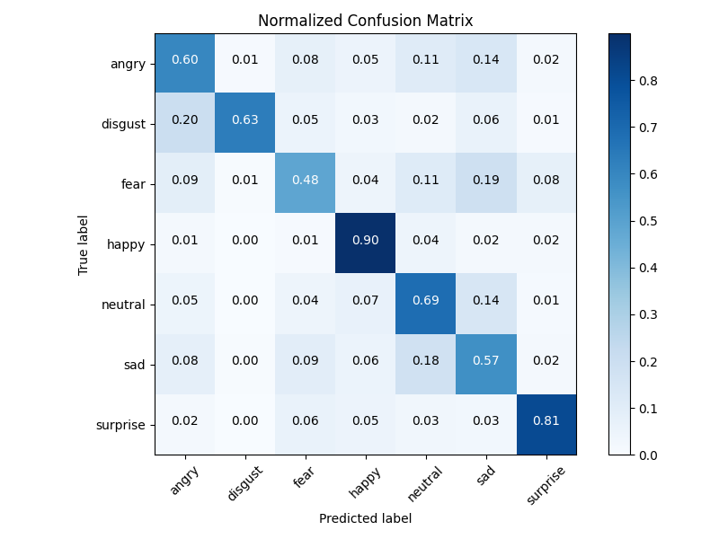

# Training Results

This folder gathers the key artefacts produced after training **Mini‑Xception‑Emo** on the FER‑2013 dataset.

| File | Purpose |
|------|---------|
| **`best_model.pt`** | Best checkpoint selected by validation accuracy |
| **`acc_performance.png`** | Validation‑accuracy curve |
| **`loss_vs_eopoch.png`** | Train / validation loss curves |
| **`confusion_matrix.png`** | Raw confusion matrix on the test split |
| **`confusion_matrix_norm.png`** | Normalised confusion matrix |
| **`roc_curves.png`** | One‑vs‑rest ROC curves for all seven classes |
| **`classification_report.txt`** | Precision / recall / F1 metrics per class |

---

## Learning curves

<p align="center">
  
</p>

<p align="center">
  
</p>

**Interpretation:**  
Accuracy rises steeply during the first ~30 epochs and slowly saturates around **69 %**.  
Both training and validation loss decrease steadily, with a modest gap that suggests limited over‑fitting.

---

## Confusion matrices

<table>
<tr>
<td></td>
<td></td>
</tr>
</table>

* The model recognises **happy** faces very reliably (≈ 90 % recall).  
* **Disgust** and **surprise** also show high true‑positive rates (> 80 %).  
* Most confusion arises between **fear ↔ sad** and **angry ↔ sad/neutral**, which is common in FER‑2013 due to subtle facial cues.

---

## ROC analysis

<p align="center">
  
</p>

Area‑under‑curve (AUC) scores range between **0.80 – 0.97**, with a **micro‑average AUC of 0.91**.

---

## Classification report

| Class | Precision | Recall | F1-score | Support |
|-------|-----------|--------|----------|---------|
| angry | 0.64 | 0.60 | 0.62 | 958 |
| disgust | 0.77 | 0.63 | 0.69 | 111 |
| fear | 0.61 | 0.48 | 0.54 | 1024 |
| happy | 0.85 | 0.90 | 0.87 | 1774 |
| neutral | 0.61 | 0.69 | 0.65 | 1233 |
| sad | 0.56 | 0.57 | 0.56 | 1247 |
| surprise | 0.80 | 0.81 | 0.81 | 831 |


Overall test‑set accuracy: **0.69** (macro F1 ≈ 0.68).

---

## Checkpoint

The file **`best_model.pt`** stores the network weights after the epoch giving the
highest validation accuracy.  
Load it in PyTorch with:

```python
import torch
device = torch.device('cuda' if torch.cuda.is_available() else 'cpu')
model = MiniXception(num_classes=7).to(device)
model.load_state_dict(torch.load("results/best_model.pt", map_location=device))
model.eval()
```
